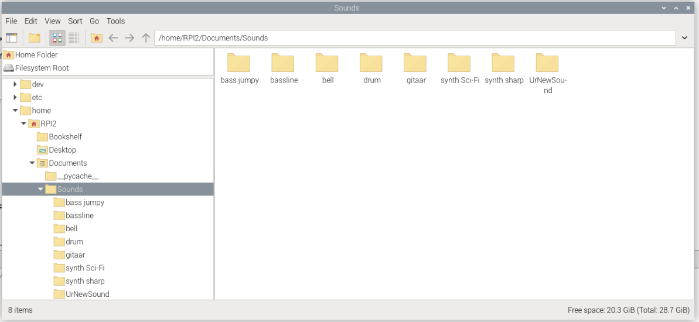
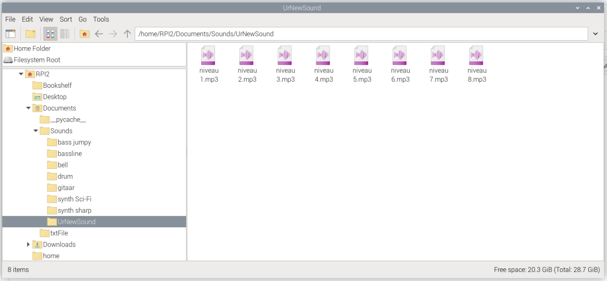

In deze README word er uitgelegt hoe je de **Pi4** moet **opzetten** , hoe je **extra ledeffects** kunt toevoegen en hoe je **extra geluiden** toevoegt op de Pi zelf. Als laatst word er gezegt hoe je gemakkelijk een **2de Pi kunt instellen**.


# 1. Pi4 instellen

Gebruik deze commands voor de juiste library's te installeren:
```
sudo apt update

sudo apt install -y \
  python3-pip python3-dev build-essential \
  libffi-dev libssl-dev \
  python3-rpi.gpio python3-numpy python3-pygame

sudo pip3 install \
  rpi_ws281x \
  flask \
  flask-cors \
  flask-socketio \
  python-socketio \
  requests \
  pygame \
  eventlet
```

Moeite met de rpi_ws281x probeer:
```
sudo pip3 install rpi_ws281x --break-systeel-packages
```
Test of het correct is geinstaleerd: 
```
sudo python3 -c "import rpi_ws281x"
```
Nu kun je alle scripts en sounds op de Pi zetten van de github. Zet de scripts onder de map ``/home/RPI2/Documents/`` en **noem ze zoals ze noemen op de github.** Zet dan alle sounds onder de map ``/home/RPI2/Documents/Sounds/`` **Hou hier bij ook dezelfde benaming van op github!!**

Run file:
```
sudo python3 /home/RPI2/Documents/main.py

python3 /home/RPI2/Documents/sound_player.py
```

## Auto start van scripts
Als je wenst dat je scripts vanzelf gestart worden vanaf de Pi stroom heeft doen we dit via systeemd.


Maak onderstaande files aan in de map ``/etc/systemd/system/``

``sound_player.service``
```
[Unit]
Description=Sound-Player Service
After=led_sensor.service sound.target
Requires=led_sensor.service sound.target

[Service]
User=RPI2
Enviroment=XDG_RUNTIME_DIR=/run/user/1000
Type=simple
WorkingDirectory=/home/RPI2/Documents
ExecStart=python3 /home/RPI2/Documents/sound_player.py
Restart=on-failure
RestartSec=5

[Install]
WantedBy=multi-user.target
```


``led_sensor.service``
```
[Unit]
Description=Sound-Art Main Service (Flask + LED)
After=network.target

[Service]
Type=simple
WorkingDirectory=/home/RPI2/Documents
ExecStart=sudo python3  /home/RPI2/Documents/main.py
Restart=on-failure
RestartSec=5

[Install]
WantedBy=multi-user.target
```

Voor het activeren van de systeemd voer je dit uit in je terminal.
```
sudo systemctl daemon-reload

sudo systemctl enable sound_player.service
sudo systemctl enable led_sensor.service

sudo systemctl start sound_player.service
sudo systemctl enable led_sensor.service
```
Heb je een probleem met de scripts die niet werken? Dan kun je alle logs zien sins de laatste met onderstaande command :
```
sudo journalctl -u sound_player.service -b
sudo journalctl -u led_sensor.service -b
```


# 2. How to add extra light effects?
In this part u wil learn how to add light effects to ur project.

## Add the code in the Pi4
**Step 1 : make ur effect in the library**

First, determine whether your effect needs a color. For example, in the rainbow effect you don't need to choose a color. Then, in the ``led_effects.py`` script, add your code. For example, you can start with:

```
 def UrNewEffect(strip, leds_to_light, hex_color):
    # Your custom code here.
    # - leds_to_light: the number of LEDs that need to be on.
    # - hex_color: the color in hexadecimal (not needed for effects like rainbow).
    # - strip: use strip.setPixelColor(i, Color(0, 0, 0, 0)) to set colors.

```

From here, you can implement your own effect.

**Step 2 : add code to main.py file**

In your main.py script, import your new effect along with the existing ones:
```
from led_effects import (effect_solid, effect_puls, effect_rainbow, effect_chase, effect_fire, effect_sparkle, IdleEffect , UrNewEffect)
```
Then, update your ``update_leds()`` function to include your effect:

```
def update_leds(leds_to_light):
    if current_effect == "solid":
        effect_solid(strip, leds_to_light, current_color)
    elif current_effect == "puls":
        effect_puls(strip, leds_to_light, current_color)
    elif current_effect == "rainbow":
        effect_rainbow(strip, leds_to_light)
    elif current_effect == "chase":
        effect_chase(strip, leds_to_light, current_color)
    elif current_effect == "fire":
        effect_fire(strip, leds_to_light)
    elif current_effect == "sparkle":
        effect_sparkle(strip, leds_to_light, current_color)
    elif current_effect == "UrNewEffect"
        UrNewEffect(strip, leds_to_light, current_color)
    else:
        effect_solid(strip, leds_to_light, current_color)
```


# 3. How to add extra sounds?
In this part u wil learn how to add extra Sounds to ur Project.

## Add the code in the Pi4
**Step 1 : Put the sound in the right folder**

Start with placing ur folder with the sound in this folder ``home/RPI2/Documents/Sound``. 


U will also need **8** different tones of ur sound. And they have to be called ``niveau 1.mp3``, ``niveau 2.mp3``, ``niveau 3.mp3``, .... ,``niveau 8.mp3``.
**Niveau 1 will play with the lowest distance. And niveau 8 with the highest distance.**



**Step 2 : Add ur sound in the ``sound_player.py``**
```
instruments = {
    "gitaar": load_instrument_sounds("gitaar"),
    "drum": load_instrument_sounds("drum"),
    "bass jumpy": load_instrument_sounds("bass jumpy"),
    "bell": load_instrument_sounds("bell"),
    "synth Sci-Fi": load_instrument_sounds("synth Sci-Fi"),
    "synth sharp": load_instrument_sounds("synth sharp"),
    "bassline": load_instrument_sounds("bassline"),
    "UrNewSound": load_instrument_sounds("UrNewSound")    
}
```
 ### How to change distance settings

 If u want to change the discance at with the sounds play, u can do that in the ``get_level()`` function in the main.py file.
```
def get_level(distance):
    if distance < 10:
        #print(f"Speelt sample niveau 1 af (afstand < 10)")
        return 1
    elif 10 <= distance < 20:
        #print(f"Speelt sample niveau 2 af (afstand 10-20)")
        return 2
    elif 20 <= distance < 30:
        #print(f"Speelt sample niveau 3 af (afstand 20-30)")
        return 3
    elif 30 <= distance < 40:
        #print(f"Speelt sample niveau 4 af (afstand 30-40)")
        return 4
    elif 40 <= distance < 50:
        #print(f"Speelt sample niveau 5 af (afstand 40-50)")
        return 5
    elif 50 <= distance < 60:
        #print(f"Speelt sample niveau 6 af (afstand 50-60)")
        return 6
    elif 60 <= distance < 70:
        #print(f"Speelt sample niveau 7 af (afstand 60-70)")
        return 7
    elif distance >= 70:
        #print(f"Speelt sample niveau 8 af (afstand >= 70)")
        return 8        
```

## Meerdere Pi’s instellen

Als je dit project op meerdere Raspberry Pi’s wilt draaien, kun je het handigst één volledig geconfigureerde SD-kaart klonen en op de andere Pi’s gebruiken. Dit doe je in twee stappen met **balenaEtcher**:

1. **SD-kaart uitlezen**  
   – Sluit de bron-SD-kaart aan op je pc en maak er met balenaEtcher een `.img`-bestand van.  
2. **SD-kaart flashen**  
   – Schrijf dat `.img`-bestand naar de doel-SD-kaart en steek die in de volgende Pi.

Ná het klonen moet je in `main.py` twee variabelen per Pi nog aanpassen, zodat elke Pi uniek is en met de website communiceert:

```python
# Regel 62: box-nummer van deze Pi
box_id = "Vul_hier_je_box_nummer_in"

# Regel 213: Tailscale-IP van deze Pi
tailscale_ip = "IP_Van_Je_Pi"
