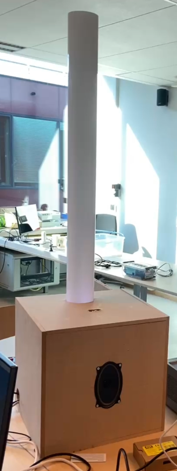

# PX4-Interactive-Sound-Art

**PX4-Interactive-Sound-Art** is een interactieve kunstinstallatie waarin je door simpele handbewegingen muziek en licht tot leven brengt. Het project combineert technologie en kunst en nodigt uit tot speels experimenteren met geluid en visuele effecten. Beweeg je hand boven een sensor en het systeem reageert onmiddellijk met klanken en licht, alsof je zelf een muzikaal instrument en lichtshow bestuurt.

De installatie is ontworpen om intuïtief en toegankelijk te zijn voor jong en oud. Of je nu houdt van technologie, kunst of gewoon wilt spelen met geluid, PX4-Interactive-Sound-Art biedt een creatieve ruimte waarin iedereen kan ontdekken en creëren.

## Doel

Met dit project willen we een brug slaan tussen digitale technologie en artistieke expressie. Het project creëert een interactieve ervaring waarbij gebruikers met handgebaren muziek en licht aansturen. Zo worden ze zelf onderdeel van het kunstwerk.

De installatie is laagdrempelig en nodigt uit tot actieve participatie. Ze stimuleert verwondering, creativiteit en nieuwsgierigheid, en toont hoe moderne technologie gebruikt kan worden als vorm van expressie in interactieve kunst.

## Technisch

De installatie bestaat uit een sensor, een Raspberry Pi, geluidsmodules en LED-verlichting. Handbewegingen worden door de sensor opgevangen en doorgestuurd naar de Raspberry Pi, die deze input verwerkt en vertaalt naar bijpassende geluiden en lichtpatronen.

De software zorgt voor een realtime reactie, waardoor een vloeiende en meeslepende interactie ontstaat. Voor wie meer wil weten over de technische kant, zoals de code en schema’s, kan je hieronder verdere informatie vinden die het project meer in detail toelicht.

## Gebruikersinterface

De gebruikersinterface is de visuele en digitale bediening van onze installatie. Het is als het ware het “controlepaneel” waarmee je onze installatie kunt aanpassen.

Via een eenvoudige en duidelijke webpagina kunnen gebruikers bepaalde functies aan- of uitzetten of instellingen wijzigen. Denk bijvoorbeeld aan het kiezen van een geluidstype of het aanpassen van de lichtkleur.

Onze frontend is voornamelijk ontworpen met Vue.js, terwijl de backend geschreven is in javascript en draait op node.js.

De interface is bewust zo ontworpen dat je geen technische kennis nodig hebt om ermee aan de slag te gaan. Alles werkt via duidelijke knoppen en visuele elementen, zodat iedereen de installatie op een intuïtieve manier kan bedienen.

  
  

👉 Klik [hier](https://soundart.devbitapp.be/) om naar onze website te gaan.

## Specificaties

Hieronder vind je een overzicht van de belangrijkste mappen van ons project. Elke map bevat specificaties over onder andere de gebruikte code en bestanden:

- **[Code Raspberry Pi](/Code_Raspberry_Pi)**  
  Bevat de broncode die draait op de Raspberry Pi. Deze code stuurt de sensor aan, verwerkt handbewegingen en activeert geluiden en lichtpatronen.

- **[Geluidsbestanden](/Geluidsbestanden)**  
  Een collectie audiobestanden die worden afgespeeld op basis van de interactie van de gebruiker met de installatie.

- **[Technische documentatie](/Technische_documentatie)**  
  Hier vind je een overzicht van alle benodigde materialen, een introductieposter van het project en verschillende schema’s zoals het elektrisch schema, softwareschema en blokschema die de werking van het systeem verduidelijken.

- **[Website](/website)**  
  Bevat de backend- en frontendcode van de gebruikersinterface. Deze interface stelt gebruikers in staat om de installatie aan te sturen en ermee te interageren via een visuele en toegankelijke bediening.

## Team

- Thorben Andries  
- Maxime Coen  
- Ward Dereeper  
- Sam De Wispeleare  
- Michiel Geeraert  
- Timo Plets  
- William Rogov  
- Joren Vandewalle
