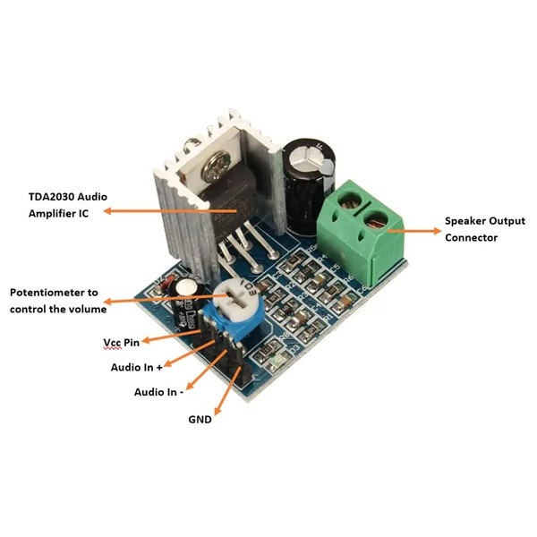

# Aansluitschema: Raspberry Pi 4 naar TDA2030 Versterker en Visaton FR 9.15 Speaker

## Benodigdheden
- **Raspberry Pi 4**
- **USB Gekuidkaart**
- **3.5mm stereo jackkabel met open uiteinde** (bijv. VOLTCRAFT XL-AC35SW)
- **TDA2030 versterkermodule**
- **Visaton FR 9.15 luidspreker (4Ω, 15W)**
- **6-12V DC voeding**
- **Optioneel: 1kΩ-10kΩ weerstanden** (voor stereo naar mono omzetting)

## Stap 1: Audio-uitgang van Raspberry Pi verbinden
### Waarom een stereo kabel?
1. Er is nu een mogelijkheid om een stereo uitbreiding te maken moest dit ooit gewenst zijn.

### Optie 1: Mono-aansluiting (eenvoudig)
1. Verbind **linker audio** van de jackkabel naar **Audio In +** van de versterker.
2. Verbind **GND** naar **Audio In -** van de versterker.

### Optie 2: Stereo naar Mono mengen
1. Verbind de **linker** en **rechter** draad met elkaar met elk nog een weerstand.
2. Verbind de uitgangen van beide weerstanden samen naar **Audio In +** van de versterker.
3. Verbind **GND (zwart)** naar **Audio In -**.

## Stap 2: Versterker aansluiten
1. **Voeding:** Sluit een **12V DC** aan op de **VCC** en **GND** van de versterker.
2. **Speaker:**
   - **Speaker Output +** → **Speaker + (Visaton FR 9.15)**
   - **Speaker Output -** → **Speaker - (Visaton FR 9.15)**
