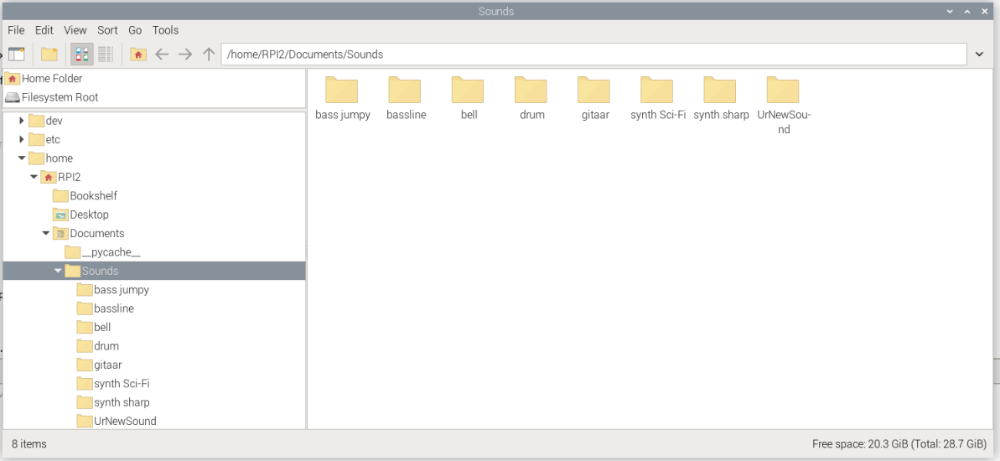
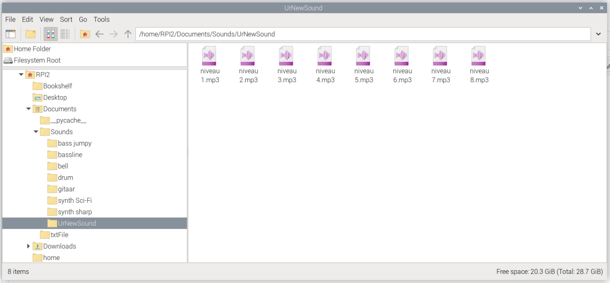

# How to add extra sounds?
## Add the code in the Pi4
**Step 1 : Put the sound in the right folder**

Start with placing ur folder with the sound in this folder ``home/RPI2/Documents/Sound``. 


U will also need **8** different tones of ur sound. And they have to be called ``niveau 1.mp3``, ``niveau 2.mp3``, ``niveau 3.mp3``, .... ,``niveau 8.mp3``.
**Niveau 1 will play with the lowest distance. And niveau 8 with the highest distance.**



**Step 2 : Add ur sound in the ``sound_player.py``**
```
instruments = {
    "gitaar": load_instrument_sounds("gitaar"),
    "drum": load_instrument_sounds("drum"),
    "bass jumpy": load_instrument_sounds("bass jumpy"),
    "bell": load_instrument_sounds("bell"),
    "synth Sci-Fi": load_instrument_sounds("synth Sci-Fi"),
    "synth sharp": load_instrument_sounds("synth sharp"),
    "bassline": load_instrument_sounds("bassline"),
    "UrNewSound": load_instrument_sounds("UrNewSound")    
}
```
 ### How to change distance settings

 If u want to change the discance at with the sounds play, u can do that in the ``Play_Sound()`` function.
```
     if distance < 10:
        sounds["niv1"].play()
        print(f"Speelt {instrument} sample niveau 1 af (afstand < 10)")
    elif 10 <= distance < 20:
        sounds["niv2"].play()
        print(f"Speelt {instrument} sample niveau 2 af (afstand 10-20)")
    elif 20 <= distance < 30:
        sounds["niv3"].play()
        print(f"Speelt {instrument} sample niveau 3 af (afstand 20-30)")
    elif 30 <= distance < 40:
        sounds["niv4"].play()
        print(f"Speelt {instrument} sample niveau 4 af (afstand 30-40)")
    elif 40 <= distance < 50:
        sounds["niv5"].play()
        print(f"Speelt {instrument} sample niveau 5 af (afstand 40-50)")
    elif 50 <= distance < 60:
        sounds["niv6"].play()
        print(f"Speelt {instrument} sample niveau 6 af (afstand 50-60)")
    elif 60 <= distance < 70:
        sounds["niv7"].play()
        print(f"Speelt {instrument} sample niveau 7 af (afstand 60-70)")
    elif distance >= 70:
        sounds["niv8"].play()
        print(f"Speelt {instrument} sample niveau 8 af (afstand >= 70)")
```
