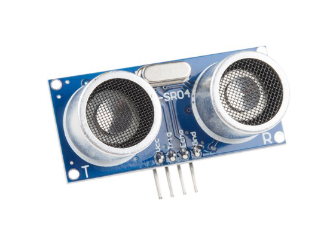
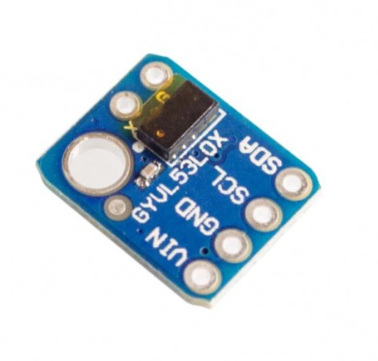

## HC-SR04
 - Goedkoop
 - Beinvloed door geluid? 
 - gebruikt ultrasoon geluid (40 kHz)
 - Detectie afstand: 2 cm - 450 cm 
 - Spanning: 5V

https://opencircuit.be/product/hc-sr04-ultrasonische-afstands-detectie-module

## VL53L0X
 - Gebruikt laser (infrarood) i.p.v. geluid → Geen last van lawaai! 
 - Goedkoop
 - Spanning(voeding en signaal): 3.3-5V DC
 - Detectie afstand: 50-1200mm(standaard)

https://www.tinytronics.nl/nl/sensoren/afstand/vl53l0x-time-of-flight-tof-afstandssensor

