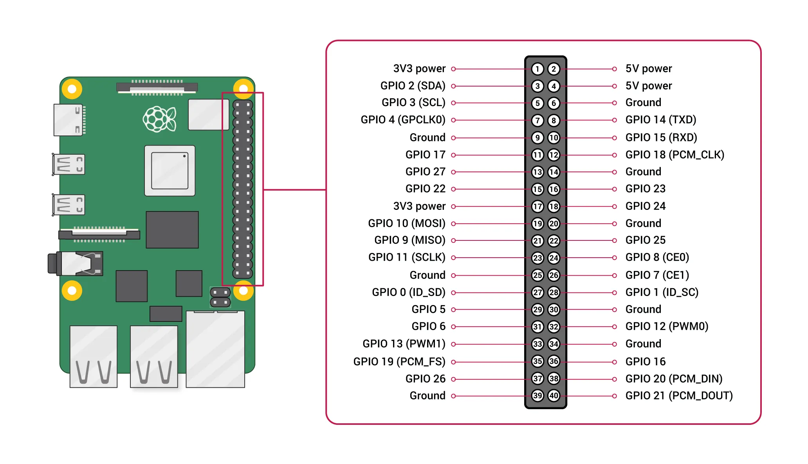
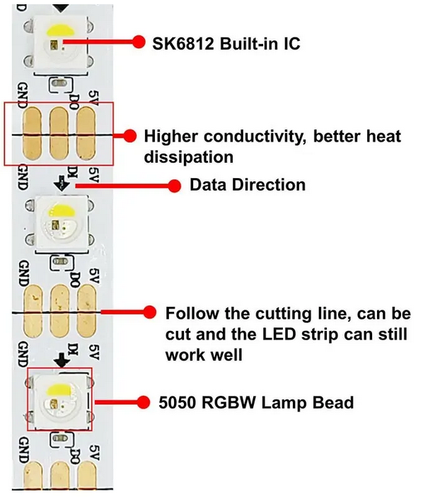
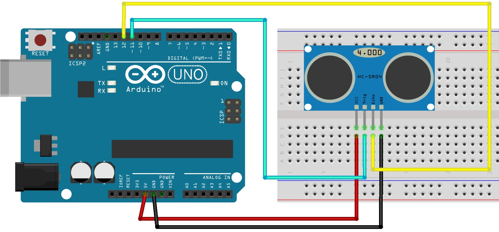
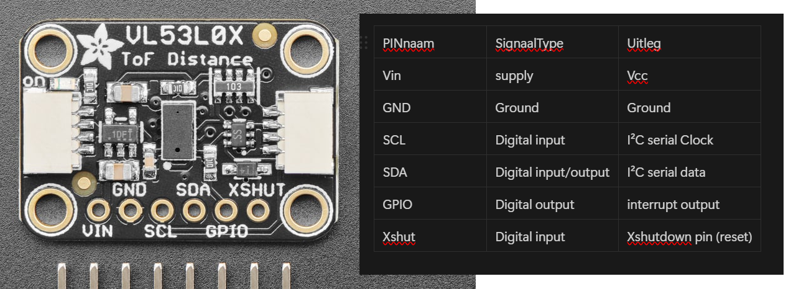

# Bekabeling en stroomvoorziening

Vooronderzoek voor de bekabeling en stroomvoorziening.

## Stroomvoorziening

Stroomvoorziening Raspberry Pi 5: 5V/5A DC
Stroomvoorziening SK6812 LEDs: 5VDC 
Stroomvoorziening Bewegingssensor:  
- HC-SR04: 5VDC
- VL53L0X: 3.3-5V
Stroomvoorziening Speaker: 12V 

## Bekabeling

Bekabeling Raspberry Pi 5: Raspberry Pi 27W USB-C Power Supply - Zwart - EU   

Bekabeling SK6812 LEDs: 

Bekabeling Bewegingssensor: 
- HC-SR04:
VCC: Powers the sensor (5V)
Trig: Trigger Input Pin
Echo: Echo Output Pin
GND: Common GND

- VL53L0X: 
IN: 3.3-5V DC Ingangsspanning
GND: ground/min
SCL: I2C clock signaal
SDA: I2C data signaal

Bekabeling Speaker: USB connectie

Alles zou moeten worden gevoed worden via 1 stekker dus er zouden vanuit de 1ne "SoundBox" naar de andere stroomkabels moeten leiden

Volledig draadloos langs buiten? -> Batterijen? -> zwaarder -> duurder 
