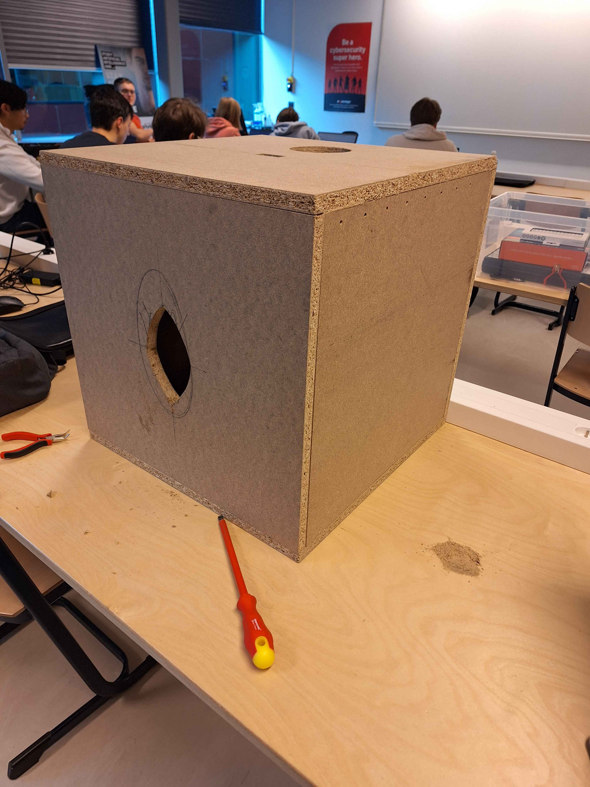
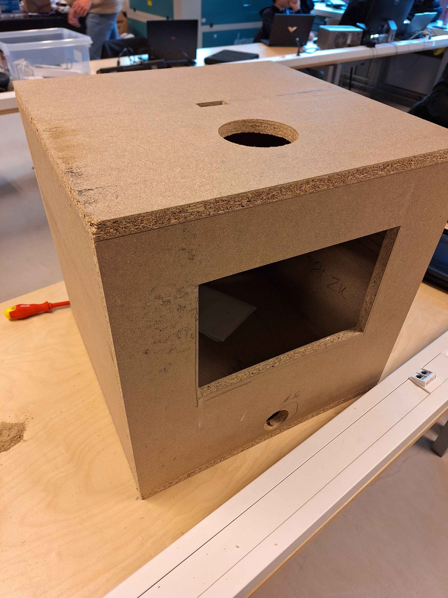

# Fysieke behuizing

## Standalone device

- 1 device
- Uitbreidbaar of niet
- Ongeveer 1m80

    
    

    
    

### Benodigdheden

- Onderkant "kist" uit bv. hout
- Speaker
- Microcontroller
- Regeling power (level shifters, spanningsregelaar, ??)
- Sensor
- Ledstrip (content addressable)
- [Acrylen buis](https://www.kunststofshop.nl/acrylaat-plexiglas/acrylaat-buizen/melkwit-opaal/acrylaat-buis-opaal-2000x90x3mm-2000x90x3mm/a-7699-20000036)
- [Doorzichtige velcro](https://www.conrad.be/nl/p/3m-klittenband-om-vast-te-plakken-l-x-b-1-25-m-x-25-mm-transparant-1-stuk-s-2144908.html?gad_source=1&refresh=true)

### Uitbreiding

- meerdere naast elkaar?
- verspreid rond elkaar?
- power door in elkaar te steken?

Hier wordt een microfoon gebruikt om zo alle lichtpalen te bedienen, wat niet de bedoeling is bij ons.

## Uitgewerkt concept

### Uiterlijk

- Gemaakt uit hout.
- Stok lengte: 1m20
- Stroom kan gechained worden.
- Led strip kan in stukken gedaan worden zodat je bijvoorbeeld in de buis aan 2 kanten een stuk ledstrip hebt, zodat het licht niet op 1 plaatst schijnt.

### Blokje

- Magnetische strook aan binnenkant lichtbuis.
- Magneet in het blokje.
- Blokje gemaakt uit licht materiaal.

### Binnenkant

- Raspberry pi
- Speaker zit aan de houten box vast.
- Stroom chain werkt met verdeelstekkers. 4 stekkers per box.
- 3.3V naar 5.0V switch voor data van raspberry pi naar ledstrip.

## **📏 Fysieke Specificaties**
- Houten doos: ~~50x50~~ cm MDF 
- Gat voor luidspreker: ~~Ø 20,5 cm~~ aan de voorkant  
- Gat voor stroomvoorziening: Achterzijde Ø 5 cm   
- Sensor-opening: 2x4,5 cm aan de bovenkant  
- Acrylaatbuis: ~~110~~ 100 cm hoog en ~~15~~ 10 cm diameter   

## (Deels) Uitgewerkte doos 27/02
OPMERKING: BOX op foto is 50x50 prototype

    
    

TODO:
- Installeren klep achterkant met scharnieren
- Uitzagen speakergat
- Monteren buis
- Monteren elektronica
- Monteren kattenkop