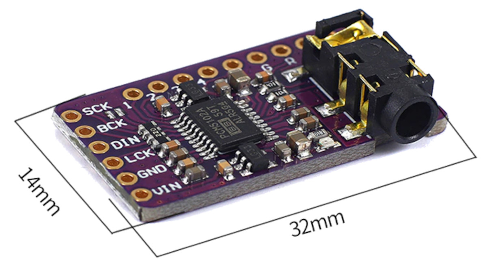
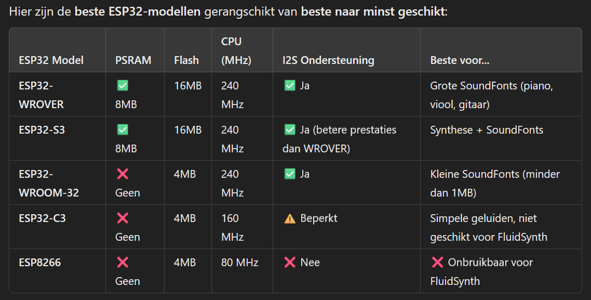

# Mircrocontroller / Raspberry Pi

Vooronderzoek voor het gebruik van een microcontroller of linux board.

Microcontroller werd niet aangeraden omdat audiobewerkingen moeilijker kan zijn -> Raspberry Pi heeft de voorkeur  

## Raspberry Pi 5 

Te bestellen? -> normaal aanwezig op school

De RaspBeryy 5 PI van school heeft geen audioJack input/output dus vandaar dat we een usb->Jack nodig zullen hebben voor de speakers
De RaspBerry 5 PI is goed voor de LEDstrips van school, 5volt is nodig.

## ESP 32

Uit eigen ervaring weet ik dat de ESP32 goed samenwerkt om LEDs te sturen, ook weet ik dat deze werkt met sensoren. alleen zijn de Audiobewerkingen wat lastiger inderdaad. 
Blijkbaar zou met gebruik van I2S het lukken om verschillende instrumenten over te brengen op een speaker

MOEILIJKHEID❌ 
niet elke ESP32 kan wat we willen doen.
