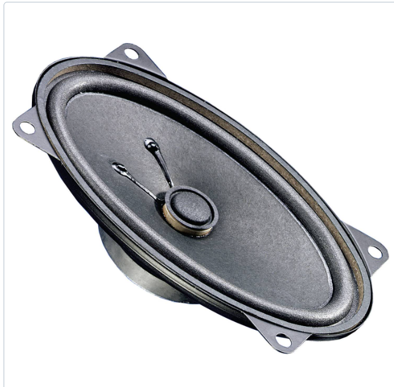

# miniatuur luidspreker (ongeveer 10W)

- Relatief goedkoop (10 - 15 euro)
- Kan je mooi aan de "doos" monteren 
- PAM8610 of andere module nodig voor aansluiting met de pi (12V voeding aangeraden)
- 
- LM385 audio amplifier (voorbeeld: https://www.instructables.com/ESP-32-Based-Audio-Player/) 

- **Extra info**: 
  - De PAM8610 biedt 10W vermogen per kanaal (stereo-output).
  - Je kunt de speaker en pi 4 via de 3.5mm audio jack aansturen en de pi 5 GPIO-PWM aansluiten (denk ik).

### Voordelen:
- Flexibel en krachtiger dan USB-speakers.
- Geschikt voor maatwerkprojecten en betere geluidskwaliteit.
- Geen softwarematige drivers nodig.
S
### Nadelen:
- Complexere setup met aparte voeding en mogelijk soldeerwerk.
- Kans op storing bij incorrecte bekabeling of voeding.

---
# gewone usb speaker

- Relatief goedkoop (10 - 25 euro)
- Makkelijker aansluitbaar
- Sommige goedkope speakers werken niet goed zonder extra drivers

### Voordelen:
- Eenvoudig aan te sluiten, geen aparte voeding nodig.
- Wordt direct herkend als een USB-audioapparaat door Raspberry Pi OS.
- Ideaal voor eenvoudige projecten.

### Nadelen:
- Goedkope modellen kunnen problemen geven:
  - Sommige vereisen specifieke drivers die mogelijk niet standaard ondersteund worden.
  - Lagere geluidskwaliteit in vergelijking met custom-oplossingen.
- Geluidsniveau en kwaliteit kunnen tegenvallen.
- Kan problemen geven als meerdere USB-apparaten veel stroom trekken (zonder powered USB-hub).

---

# Voordelen van de Monacor SPM-200X/4 voor een Sound Art Systeem SPRINT 2

## 1. **Breed frequentiebereik voor een rijk geluid**
   - Als een breedband-luidspreker bestrijkt de **SPM-200X/4** een groot deel van het hoorbare spectrum zonder de noodzaak van extra tweeters of subwoofers.
   - Ideaal voor het reproduceren van zowel lage als hoge tonen in een interactieve sound art installatie.

## 2. **Hoge belastbaarheid (60W)**
   - Kan **hoge volumes aan zonder vervorming**, wat handig is voor een dynamische en meeslepende ervaring.
   - Werkt goed met de **TPA3116D2 versterker**, die een vergelijkbaar vermogen aankan.

## 3. **Lage impedantie (4Ω)**
   - Perfect geschikt voor de **TPA3116D2 versterkermodule**, die is ontworpen om efficiënt met 4Ω belastingen te werken.
   - Zorgt voor een betere stroomtoevoer en geluidskwaliteit.

## 4. **Efficiënte koppeling met de TPA3116D2**
   - De **TPA3116D2 klasse-D versterker** is efficiënt en genereert weinig warmte.
   - Door de **lage THD (Total Harmonic Distortion)** blijft het geluid helder, wat belangrijk is voor sound art waarbij nuances in geluid cruciaal zijn.

## 6. **Compatibiliteit met Raspberry Pi 4**
   - De Raspberry Pi 4 kan de **TPA3116D2 aansturen via I2S of via een externe USB-DAC**, wat zorgt voor een hoge kwaliteit digitale audio-uitvoer.
   - Geschikt voor interactieve toepassingen waarbij de audio real-time gemanipuleerd wordt.

## 7. **Goede prijs-kwaliteitverhouding**
   - In vergelijking met hi-fi luidsprekers biedt de Monacor SPM-200X/4 een uitstekende balans tussen **prijs en prestaties**.
   - Geschikt voor een budgetvriendelijk project zonder in te leveren op geluidskwaliteit.

# Sprint 3 : besparen op de speaker

## 🔹 **Waarom de Visaton FR 9.15?**  

### **1. Breed frequentiebereik**  
- Als een **breedband-luidspreker** kan deze speaker zowel **hoge als lage tonen** goed weergeven.  
- Geschikt voor sound art waarbij **heldere vocalen en omgevingsgeluiden** belangrijk zijn.  

### **2. Compact & veelzijdig ontwerp**  
- Met een **ovaal ontwerp (5.9 inch / 15 cm)** is deze luidspreker **compact**, maar toch krachtig.  
- Ideaal voor installaties waar ruimte beperkt en kosten beperkt zijn.  

### **3. Lage impedantie (4Ω) & efficiëntie**  
- Werkt **efficiënt met versterkers**, zoals de **TDA2030A**.  
- **Lage impedantie betekent meer vermogen uit een kleinere versterker**.  

### **4. Duurzaam & robuust**  
- De stevige constructie zorgt ervoor dat de speaker **lang meegaat**, zelfs bij continu gebruik.  
- Bestand tegen trillingen en lichte mechanische stress, wat handig is in interactieve installaties.  

---

## 🔹 **Waarom de combinatie met de TDA2030A versterker?**  

### **1. Meer vermogen beschikbaar**  
- De **TDA2030A kan tot 18W leveren bij 4Ω**, wat **beter aansluit bij het maximale vermogen van de Visaton FR 9.15 (15W)**.  
- Dit betekent **hoger volume zonder vervorming**, ideaal voor sound art.  

### **2. Ondersteunt Bridge-Tied Load (BTL) modus**  
- **De TDA2030A kan in brugmodus worden geschakeld**, waardoor je **één enkele speaker van hoger vermogen** kunt voorzien.  
- Perfect als je maar **één luidspreker** gebruikt, omdat je **beide versterkerkanalen combineert zonder extra weerstanden of software-aanpassingen**.  

### **3. Hogere geluidskwaliteit & minder vervorming**  
- De **TDA2030A heeft een lagere THD (Total Harmonic Distortion)** dan veel andere budgetversterkers, wat betekent dat het geluid **schoner en nauwkeuriger** blijft.  

### **4. Werkt op een eenvoudige voeding (12V – 24V)**  
- Werkt met **dezelfde spanning als de TDA7266 (9V - 12V)**, maar kan ook tot **24V** aan voor extra vermogen.  
- Meer flexibiliteit als je een krachtigere voeding wilt gebruiken.  

---

## 🎯 **Conclusie**  
De combinatie van de **Visaton FR 9.15 (15W, 4Ω) luidspreker** en de **TDA2030A versterker** is **perfect voor een sound art systeem** dat **helder, krachtig en efficiënt** geluid nodig heeft. De **lage impedantie en BTL-optie** maken deze setup ideaal voor een **Raspberry Pi 4 audio-installatie** met een **goede balans tussen prestaties en kosten**. 
