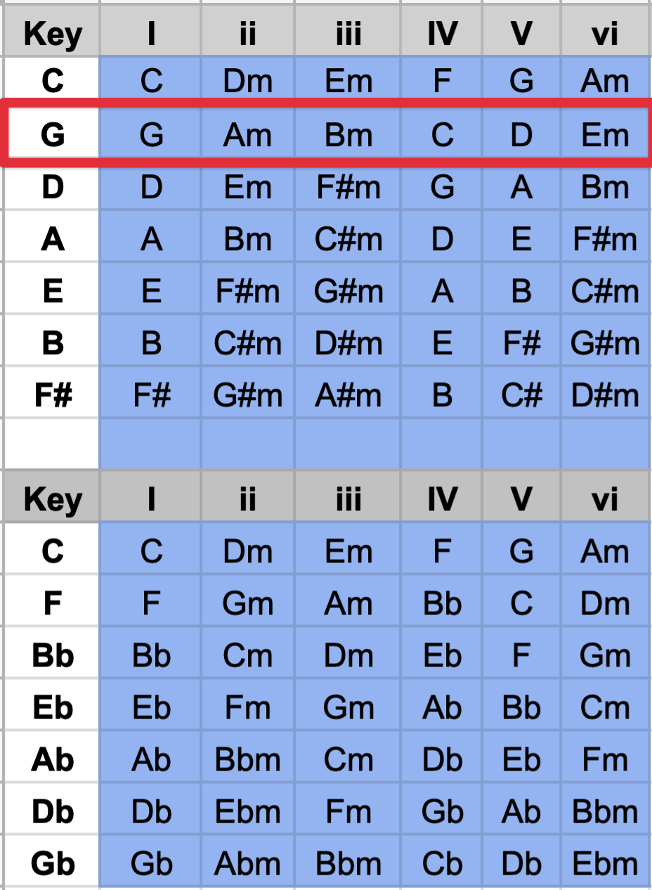

# Tonen

Noten/ toonhoogtes kunnen in verschillende sleutels bevinden, dit zorgt ervoor dat de instrumenten "mooi" samen klinken zolang
de noten die gespeeld worden in die toonlader/sleutel horen.



# Van 1 .Wav naar verschillende tonen gaan

```python
from pydub import AudioSegment
from pydub.playback import play

def change_pitch(sound, semitones):
    new_sample_rate = int(sound.frame_rate * (2.0 ** (semitones / 12.0)))
    return sound._spawn(sound.raw_data, overrides={'frame_rate': new_sample_rate}).set_frame_rate(44100)

# Load the original sound (e.g., a piano note)
sound = AudioSegment.from_file("path/to/your/piano_note.wav")

# Change the pitch by +4 semitones (major third)
higher_pitch = change_pitch(sound, 4)

# Change the pitch by -3 semitones (minor third)
lower_pitch = change_pitch(sound, -3)

# Export the manipulated sounds
higher_pitch.export("higher_pitch_piano_note.wav", format="wav")
lower_pitch.export("lower_pitch_piano_note.wav", format="wav")

# Optionally, play the sounds
play(higher_pitch)
play(lower_pitch)