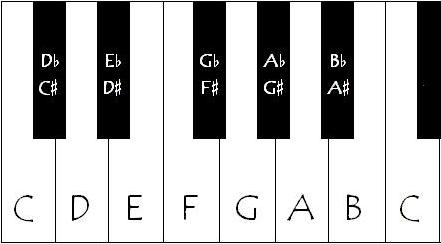

# Tonen

Noten/ toonhoogtes kunnen in verschillende sleutels bevinden, dit zorgt ervoor dat de instrumenten "mooi" samen klinken zolang
de noten die gespeeld worden in die toonlader/sleutel horen. We kunnen ook kijken als alle 12 noten mogelijk zijn. Je kunt het best beginnen met de sleutel die alle witte noten bevat: C-majeur (C D E F G A B C). 

# Hoe?

- afstand binnenlezen via ultrasone sensor (berekening afstand: Afstand = (Tijd∗Snelheidvangeluid)/2)
- Zet om naar frequentie of sample 
- speelt toon af met juist pitch of sample

- Bv: om de 10cm een noot (dus 120cm)
- 1 noot die doorklinkt (dus we werken met hele noten voor te beginnen)
- Voorlopig met apparte files werken, (misschien later noten in code veranderen)
- Latere uitbreiding (akkoorden, gebroken akkoorden, arpegio's etc...)

- Voor te beginnen, raad ik aan om om de 10 cm, een noot te laten spelen, (dus 70cm in totaal) of  om de 20 cm (dus 140cm in totaal). Dus de 30-40cm range zal bv een C5 spelen en de 40-50cm range zal de D5 spelen (hogere noot)