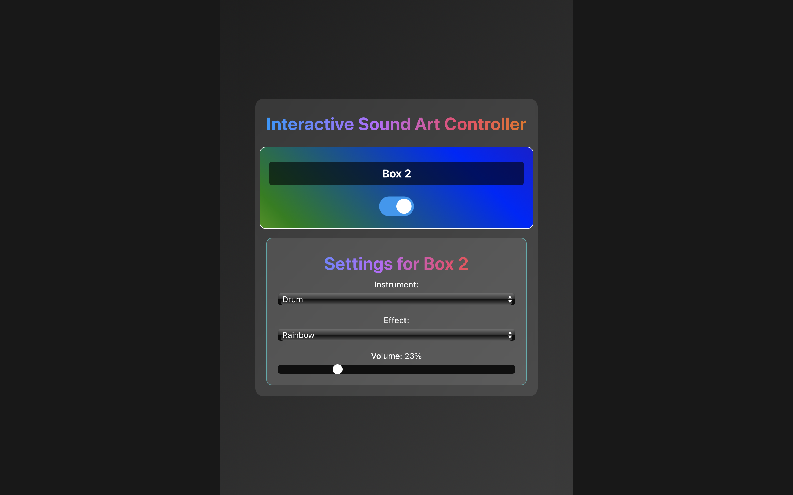

# PX4 Interactive Sound Art Website

Deze website is een interactieve ervaring die geluid en kunst combineert. Het project is ontworpen om gebruikers te betrekken bij een unieke audiovisuele beleving, waarbij technologie en creativiteit samenkomen.

## Over het project

De website is gebouwd met moderne webtechnologieën zoals Vue.js voor de frontend en Node.js voor de backend. Het ontwerp is responsief, wat betekent dat het zich aanpast aan verschillende schermformaten, zoals desktop en mobiel. Dit zorgt ervoor dat gebruikers op elk apparaat een optimale ervaring hebben.

## Weergaven

De website ondersteunt verschillende weergaven:

- **Desktopweergave**: Een breed scherm met een volledig overzicht van de interactieve elementen.
- **Mobiele weergave**: Een geoptimaliseerde versie voor kleinere schermen, met behoud van alle functionaliteiten.

### Desktopweergave

### Mobiele weergave

## Hoe het is gemaakt

- **Frontend**: Vue.js
- **Backend**: Node.js
- **Interactiviteit**: JavaScript voor dynamische elementen
- **Responsiviteit**: CSS Media Queries voor aanpassing aan verschillende schermformaten

## Technische informatie

Voor meer gedetailleerde informatie over de werking van de gebruikersinterface kun je onderstaande links volgen:

- Klik [hier](./frontend/README.md) voor een uitgebreide uitleg over de **frontend**.
- Klik [hier](./backend/README.md) voor een uitgebreide uitleg van de **backend**.

Deze secties geven inzicht in de opbouw, gebruikte technologieën en functionaliteit van beide onderdelen van de installatie.

⬅️ [Terug naar overzicht](../README.md)

